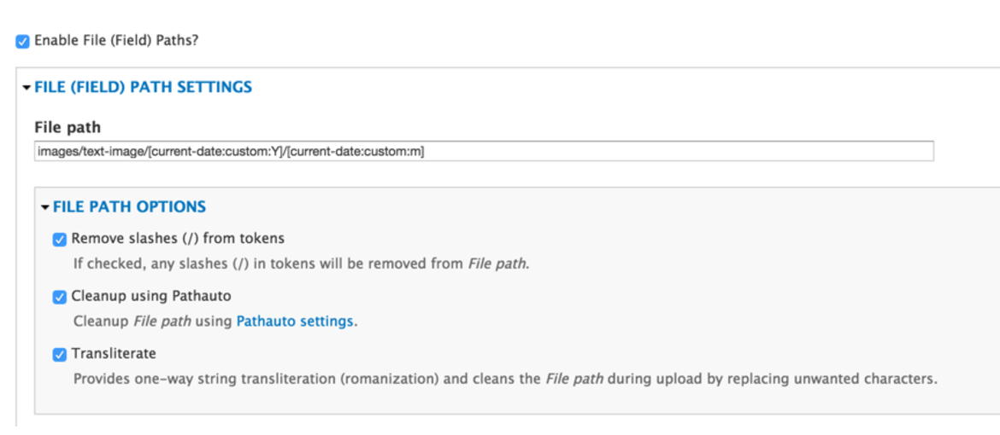

## Configuration management

### Features

We use the [Features module](https://drupal.org/project/features) to export configuration to code so it can be stored
in version control.  On deployment, our deployment processes revert all features to their code based state so any changes
made on an environment will be lost on the next deployment if they have not been exported to code.

Features configuration should be exported to a module located in the `sites/all/modules/custom` folder.

Features modules on a site should have some logical organisation. A typical strategy for organising your Drupal Features
is to create a feature module for different features of your site that a user will interact with. Using the analogy of a
blog feature, you might export into your blog feature module the configuration for content types, fields, views,
pathauto settings and whatever else is required to make the blog feature work. This is typically enough for a site.

A more complex strategy is the shared dependencies approach where we export base components, like field_bases, into a set
of base modules. Drupal Features still follows the traditional approach and we may have feature modules for our blog,
news, etc. Common components of our top tier of features are moved into the lowest tier. Thus the lowest tier is a
series of Drupal Feature modules which group together common components from the top tiers.  This has the advantage of
smaller feature modules which are easy to manage and is good for larger more complex sites.

### Variables

All variables should be stored using Features (via strongarm) unless:

1. they need to be controlled by some kind of per-environment logic.
2. they are so unbelievably important that you shouldn't ever be able to change them from the UI (Acquia purge settings).
3. you are really sure its better to be in the conf file.

Deeson have devised our own [Drupal Settings File Strategy](https://www.deeson.co.uk/labs/site-configuration-strategy-or-how-manage-your-settingsphp-files)

Settings files are stored in `sites/all/conf/*.settings.inc` with a separate files for each sub module which needs
configuration storing like this. This keeps the settings neatly separated.  The following environment variables should
be available within the settings files allowing switches in code to set different configuration based on:

The following `ENVIRONMENT VARIABLES` are always available within these settings files:

| Environment variable | Type       | Value(s)                                      |
|----------------------|------------|-----------------------------------------------|
| SETTINGS_ENVIRONMENT | string     | 'local', 'dev', 'test' or 'prod'              |
| SETTINGS_INSTANCE    | string     | Domain, e.g. 'mysite.dev' or 'www.mysite.org' |
| SETTINGS_PLATFORM    | string     | platform identifier e.g. 'acquia' or 'vdd'    |

### Metatags

Metatags should be handeled using the [metatags module](https://drupal.org/project/metatags)

1. Ideally you will have a teaser field and teaser image field on all content types to be used with metatag data.
2. Metatags module config is done at /admin/config/search/metatags on your site - make sure you set the default description text for content to your teaser field (e.g. [node:field-teaser-text]) and the opengraph teaser text to the same value.
3. Include the [imagecache_token](https://www.drupal.org/project/imagecache_token) module in your site (this will be used for setting the opengraph image later)
4. Create an image style for use with og:image tags (call it opengraph-image-1200x630 and set to scale and crop 1200x630 as these are the prefered dimensions for opengraph teasers).
5. You can then specify the opengraph image metatag to be that image style e.g. [node:field_teaser_image:opengraph_image_1200x600]
6. You can add per content type metatag settings by clicking on the "Add default meta tags" option from the Metatags admin screen
7. You can export all your metatag information to Features using a command like `drush @vdd fe mysite_metatag "metatag:%" -y`
8. If your frontpage is a node you can just disable the `Global: Front page` option on the metatags admin form and export this to features.

A good way to test metatags is to use [Facebooks scraping tool](https://developers.facebook.com/tools/debug/). After passing a page on your site you'd expect to see the right title, description and lead image.

### Image styles

It is expected that when we output any user uploaded image it should pass through an image style. This must always be the case.

This is for a number of reasons:

1. The end user should not be expected to optimise images for the web, image styles do this automatically. This helps with page performance - if the user uploads a large image the page will be slow to render. When passed through an image style the optimised image means fast page loads
2. We do not want issues reported because they have uploaded an image of dimensions which break the design. Image styles should generally be set to scale and crop which ensures that images are of the correct dimensions. Often, we only set the width of the image and let the height flex depending on the image. In some cases, we also set the height, this is a judgement call based on the design.

Image styles can be exported using features and should generally be exported to the site structure module (mysite_structure)

### File and image upload paths

Whenever you create an image or file field you must set the upload directory to something sensible. This is the place the user uploaded files will be saved to. Leaving this field blank means all files end up in the root of the file directory (i.e. sites/default/files). On a well used site thousands of files can be uploaded here which makes the file directory a mess and can even cause performance problems. It is even possible to hit an upper limit of files in a directory and crash the server (several thousand but we’ve seen it happen).

1. Include the [filefield_paths](https://drupal.org/project/filefield_paths) module in your Drupal build
2. You must set the field upload path per field. Choose a good strategy for setting the file upload path. E.g. a pattern of the form: `images/text-image/[current-date:custom:Y]/[current-date:custom:m]` puts the file into a subdirectory including the year and month uploaded.

### Alt and image tags for images

We need to allow the web authors the ability to set the alt and title attributes of images they upload. Alt attributes are required for accessibility and it is something that is often checked for by our clients and is expected by people using websites using screen readers and other accessibility devices.

The Drupal [Media module](https://drupal.org/project/media) provides alt and title fields on image entities when enabled, the administration of these fields can be seen at the admin page /admin/structure/file-types/manage/image/fields

### Notices and errors

Make sure your code is not generating notices and errors. You can check the output of the logging in the watchdog log or syslog on VDD http://logs.dev/

Notices and errors get logged so even if there is no outward signs of issues resources are being used to log the problem and the log is full of useless messages which makes diagnosing future issues a problem

Notices are often caused by variables used in template files not being set. Check for them before printing them using something like `if (!empty($var))`

### WYSIWYG Editor

The WYSIWYG editor of choice is CKEditor installed using the [CKEditor module](https://drupal.org/project/ckeditor). Be selective as to which buttons to enable, typically content editors need only a few. Configuration for CKEditor should be exported using Features to your sites structure module (mysite_structure)

